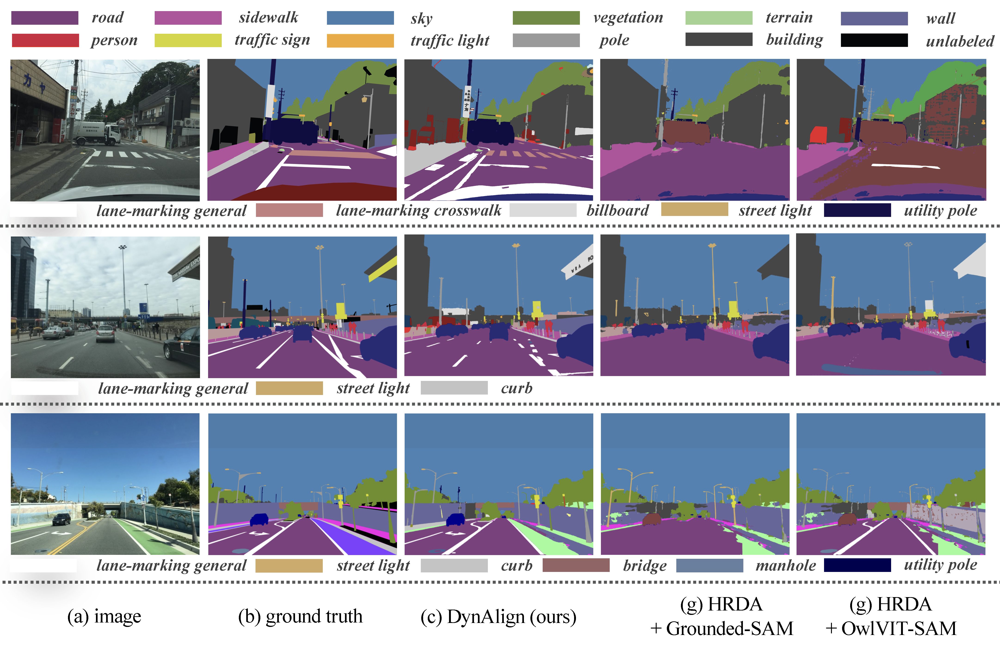
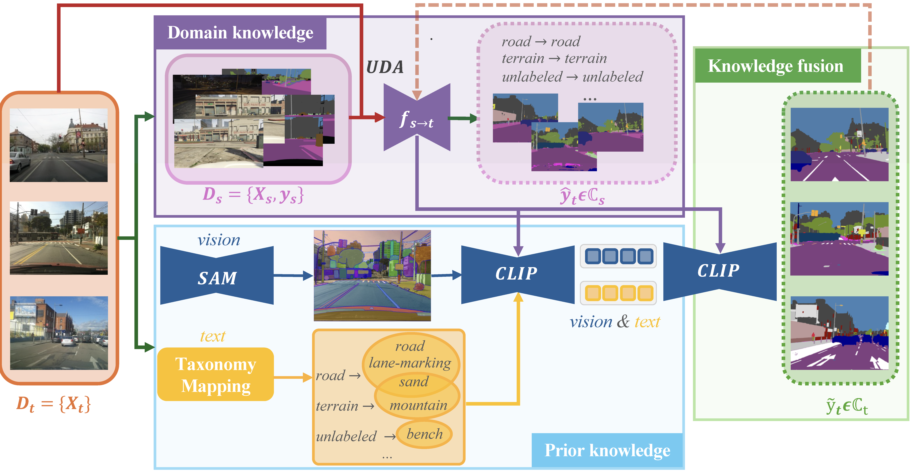
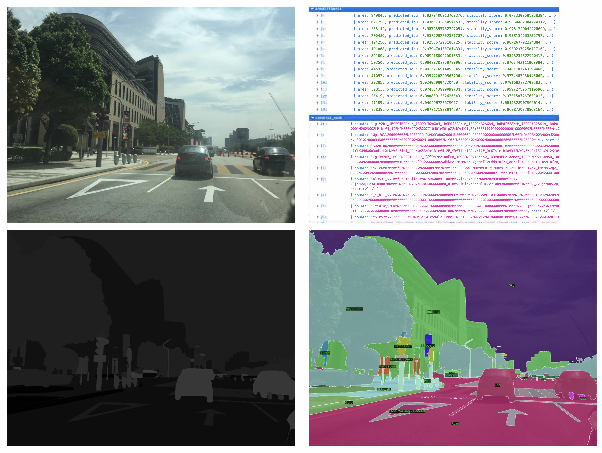

<div align="center">

<h1>[ICLR 2025] DynAlign: Unsupervised Dynamic Taxonomy Alignment for Cross-Domain Segmentation</h1>

<div>
    <a href='https://hansunhayden.github.io/' target='_blank'>Han Sun</a><sup>1</sup>&emsp;
    <a href='https://scholar.google.com/citations?hl=en&user=4St8MdYAAAAJ&view_op=list_works&sortby=pubdate' target='_blank'>Rui Gong</a><sup>2</sup>&emsp;
    <a href='https://scholar.google.com/citations?user=UWdDYtAAAAAJ&hl=fr' target='_blank'>Ismail Nejjar</a><sup>1</sup>&emsp;
    <a href='https://people.epfl.ch/olga.fink?lang=en' target='_blank'>Olga Fink</a><sup>1</sup>
</div>
<div>
    <sup>1</sup>EPFL, <sup>2</sup>Amazon
</div>


[//]: # (<div>)

[//]: # (    <h4 align="center">)

[//]: # (        • <a href="https://arxiv.org/pdf/2406.01078" target='_blank'>ICLR 2025</a> •)

[//]: # (    </h4>)

[//]: # (</div>)

 [[Paper]](https://arxiv.org/abs/2501.16410)
 [[Poster]](https://drive.google.com/file/d/1dgqxAg1ubCcHoz8pYqSyV9JIgXJSTkoG/view?usp=sharing)
 [[Huggingface Demo (coming soon)]](https://arxiv.org/pdf/2406.01078)



[//]: # (<div style="text-align:center">)

[//]: # ()

[//]: # (</div>)

---

</div>


>**Abstract:** Current unsupervised domain adaptation (UDA) methods for semantic segmentation typically assume identical class labels between the source and target domains. This assumption ignores the label-level domain gap, which is common in real-world scenarios, thus limiting their ability to identify finer-grained or novel categories without requiring extensive manual annotation.
A promising direction to address this limitation lies in recent advancements in foundation models, which exhibit strong generalization abilities due to their rich prior knowledge. However, these models often struggle with domain-specific nuances and underrepresented fine-grained categories.
To address these challenges, we introduce **Dynalign**, a framework that integrates UDA with foundation models to bridge both the image-level and label-level domain gaps. Our approach leverages prior semantic knowledge to align source categories with target categories that can be novel, more fine-grained, or named differently (e.g., *vehicle* to {*car*, *truck*, *bus*}). Foundation models are then employed for precise segmentation and category reassignment. To further enhance accuracy, we propose a knowledge fusion approach that dynamically adapts to varying scene contexts. **Dynalign** generates accurate predictions in a new target label space without requiring any manual annotations, allowing seamless adaptation to new taxonomies through either model retraining or direct inference.
Experiments on the street scene semantic segmentation benchmarks GTA→Mapillary Vistas and GTA→IDD validate the effectiveness of our approach, achieving a significant improvement over existing methods.


## 💻 Requirements
- Python 3.7+
- CUDA 11.1+

## 🛠️ Installation
```bash
conda env create -f env.yml
```
You can also build the environment with docker.
<details>
<summary>Docker file</summary>

```
# Getting base ubuntu image with platform specified (important if you build on Apple Silicon)
# FROM --platform=linux/amd64 ubuntu:latest

# ARG BASE_IMAGE=nvidia/cuda:12.1.1-runtime-ubuntu20.04
ARG BASE_IMAGE=nvidia/cuda:11.1.1-cudnn8-devel-ubuntu20.04
FROM ${BASE_IMAGE} as dev-base

# Set environment variables
ENV DEBIAN_FRONTEND=noninteractive

# Installing ssh, rsync, rclone, anaconda, vscode-server
# Here Miniconda3-py39_23.5.2-0-Linux-x86_64.sh should be downloaded from 
# https://docs.conda.io/en/latest/miniconda.html and placed in
# same folder as dockerfile, this image still includes installation of sudo,
# but after applying abovementioned restriction, it will became useless

# Update and install necessary packages
# installing tzdata separately to avoid interactive configuration
# RUN apt-get update && apt-get install -y openssh-server sudo rsync rclone
RUN apt-get update && \
    apt-get install -y openssh-server sudo rsync rclone git tzdata && \
    # todo
    apt-get install ffmpeg libsm6 libxext6 -y && \
    ln -fs /usr/share/zoneinfo/Europe/Zurich /etc/localtime && \
    dpkg-reconfigure --frontend noninteractive tzdata && \
    rm -rf /var/lib/apt/lists/*

# Install Miniconda
RUN wget -O- https://aka.ms/install-vscode-server/setup.sh | sh
RUN wget https://repo.anaconda.com/miniconda/Miniconda3-latest-Linux-x86_64.sh -O /tmp/miniconda_install.sh
RUN bash /tmp/miniconda_install.sh -b -p /usr/local/miniconda3

# Update Conda to the latest version
RUN /usr/local/miniconda3/bin/conda update -n base -c defaults conda

# Build arguments, for 'LDAP_' argument you can find information in your people.epfl.ch page
# admnistrative section, for SSH we recommend using public key instead of password, since it
# is visible in layers description after building

ARG LDAP_USERNAME
ARG LDAP_UID
ARG LDAP_GROUPNAME
ARG LDAP_GID
ARG SSH_PUBLIC_KEY

# Adding user and configuring SSH

RUN echo "${LDAP_USERNAME}  ALL=(ALL) NOPASSWD: ALL" >> /etc/sudoers.d/sshd
RUN mkdir /var/run/sshd
RUN sed 's@session\s*required\s*pam_loginuid.so@session optional pam_loginuid.so@g' -i /etc/pam.d/sshd

RUN groupadd ${LDAP_GROUPNAME} --gid ${LDAP_GID}
RUN useradd -m -U -s /bin/bash -G ${LDAP_GROUPNAME} -u ${LDAP_UID} ${LDAP_USERNAME}
RUN mkdir -p /home/${LDAP_USERNAME}/.ssh
RUN touch /home/${LDAP_USERNAME}/.ssh/authorized_keys
RUN echo ${SSH_PUBLIC_KEY} > /home/${LDAP_USERNAME}/.ssh/authorized_keys
RUN chown ${LDAP_USERNAME}:${LDAP_GROUPNAME} /home/${LDAP_USERNAME}/

RUN mkdir /opt/ssh
RUN ssh-keygen -q -N "" -t dsa -f /opt/ssh/ssh_host_dsa_key
RUN ssh-keygen -q -N "" -t rsa -b 4096 -f /opt/ssh/ssh_host_rsa_key
RUN ssh-keygen -q -N "" -t ecdsa -f /opt/ssh/ssh_host_ecdsa_key
RUN ssh-keygen -q -N "" -t ed25519 -f /opt/ssh/ssh_host_ed25519_key
RUN cp /etc/ssh/sshd_config /opt/ssh/
RUN cat <<EOT >> /opt/ssh/sshd_config
Port 2022
HostKey /opt/ssh/ssh_host_rsa_key
HostKey /opt/ssh/ssh_host_ecdsa_key
HostKey /opt/ssh/ssh_host_ed25519_key
LogLevel DEBUG3
ChallengeResponseAuthentication no
PidFile /opt/ssh/sshd.pid
EOT
RUN chmod 600 /opt/ssh/*
RUN chmod 644 /opt/ssh/sshd_config
RUN chown -R ${LDAP_USERNAME}:${LDAP_GROUPNAME} /opt/ssh/
RUN chown ${LDAP_USERNAME}:${LDAP_GROUPNAME} /etc/systemd/system/sshd.service

EXPOSE 2022

# Configuring Anaconda
USER ${LDAP_USERNAME}
WORKDIR /home/${LDAP_USERNAME}
SHELL ["/bin/bash", "--login", "-c"]
# ENV PATH="/usr/local/anaconda3/bin:$PATH"
ENV PATH="/usr/local/miniconda3/bin:$PATH"

COPY environment.yaml .
RUN conda env create -f env.yaml
RUN conda init bash

CMD ["/usr/sbin/sshd", "-D", "-f", "/opt/ssh/sshd_config", "-E", "/tmp/sshd.log"]
```
</details>

## Method
**DynAlign** integrates with any UDA model, leveraging its domain-specific knowledge and enhancing it with prior knowledge from foundation models.



  

##  🗺️ Run on Mapillary Dataset

### Checkpoints

First, download the models from the table below and place them in the `./checkpoints` folder.
For training the domain-adaptive semantic segmentation model, please refer to the [HRDA repository](https://github.com/lhoyer/HRDA).

| Model        | checkpoint                                                                                                                                         |
|--------------|----------------------------------------------------------------------------------------------------------------------------------------------------|
|HRDA | [seg_hrda/iter_40000_relevant.pth](https://drive.google.com/drive/folders/1P22nPETc9-bQ3mNexzkqpsI_Z80mGdLI?usp=sharing)                           |
|ConvCLIP       | [CLIP-convnext_large_d_320.laion2B-s29B-b131K-ft-soup](https://huggingface.co/laion/CLIP-convnext_large_d_320.laion2B-s29B-b131K-ft-soup/tree/main) |
|SAM| [sam_vit_h_4b8939.pth](https://huggingface.co/HCMUE-Research/SAM-vit-h/blob/main/sam_vit_h_4b8939.pth)  |

  ~~~
  checkpoints
  |-- CLIP-convnext_large_d_320.laion2B-s29B-b131K-ft-soup
  |-- seg_hrda
  `-- |-- iter_40000_relevant.pth
  `-- |-- seg_hrda.json
  |-- sam_vit_h_4b8939.pth
  ~~~


### Dataset
Please download the [Mapillary Vistas Dataset](https://www.mapillary.com/dataset/vistas) from the official website and place it under the `./data` directory.

### Inference on the Mapillary Validation Dataset

Run `mapillary.sh` to perform inference on the Mapillary validation dataset:

```bash
#!/bin/bash --login

python -u dynalign_mapillary.py \
  --world_size 1 \
  --dataset Mapillary \                      # HRDA inference dataset
  --dataset_sam mapillary_openset \          # SAM inference dataset
  --data_dir ./data/mapillary_vistas/validation \  # Inference dataset directory
  --sam_path ./checkpoints/sam_vit_h_4b8939.pth \   # SAM checkpoint
  --config ./checkpoints/hrda/seg_hrda.json \       # HRDA model configuration
  --checkpoint ./checkpoints/hrda/iter_40000_relevant.pth \  # HRDA checkpoint
  --save_img \                               # Whether to save the original RGB image
  --save_original_seg \                      # Whether to save the HRDA segmentation result
  --out_dir ./mapillary_result \                  # Output directory for results
  --prob_threshold 0.6                       # Probability threshold for assigning new target classes
```

After running inference, results will be saved in the following structure under `./mapillary_result`:
  ~~~
  mapillary_result
  |-- images  # original RGB image
  |-- json  # segmentation result in json format
  |-- label  # output label
  |-- visualization  # output label visualization
  ~~~




## 💌 Acknowledgement

Our generation pipeline is based on [HRDA](https://github.com/lhoyer/HRDA) and [Semantic-Segment-Anything](https://github.com/fudan-zvg/Semantic-Segment-Anything)

Big thanks to these amazing open-source works!


## 📝 Citation
If you find our work useful in your research please consider citing our paper:

```
@misc{sun2025dynalignunsuperviseddynamictaxonomy,
      title={DynAlign: Unsupervised Dynamic Taxonomy Alignment for Cross-Domain Segmentation}, 
      author={Han Sun and Rui Gong and Ismail Nejjar and Olga Fink},
      year={2025},
      eprint={2501.16410},
      archivePrefix={arXiv},
      primaryClass={cs.CV},
      url={https://arxiv.org/abs/2501.16410}, 
}
```